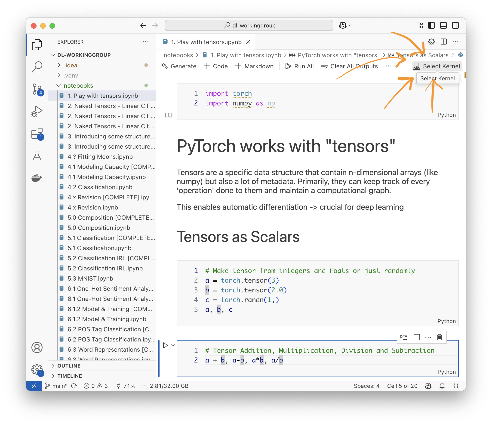
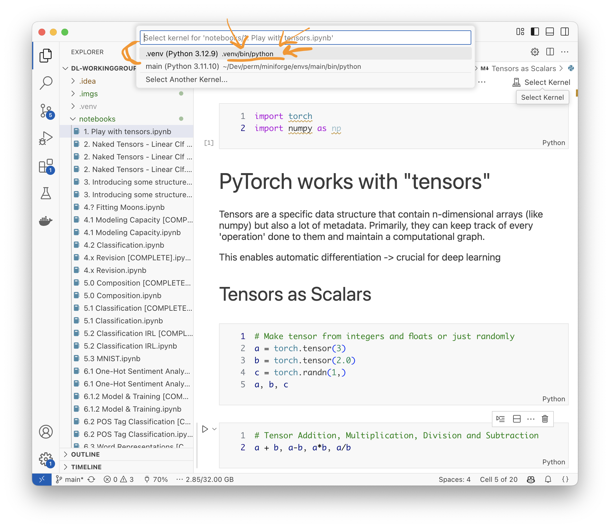

This repository consists the Jupyter Notebooks, and other resources for our Deep Learning From Scratch Working Group, executed at Semagramme, INRIA Nancy in 2022-2023 by yours truly.

Aaaand has subsequently been extended to work in other contexts ...

# Set Up

In 2025, setting up Python envs has never been easier. 
All that you have to do is to run the shell file - `setup.sh` - and you are good to go. 

### For Windows Users

- Step 1: Format your hard drive
- Step 2: Install your preferred Linux distro
- Step 3: ???
- Step 4: Profit?

okbutforrealthough: idk how to run shell scripts on windows. You want to have `uv` installed in your system. 
Then, navigate to the repo and just do a `uv sync`.

### Optional Dependency - Graphviz

THIS IS REALLY NOT NEEDED but if you want to follow along _every_ step of the way, 
    install [Graphviz](https://graphviz.org/download/) on your machine.

### Testing if you're all good

Run the following command in your terminal (in the project's root directory):

```bash
uv run test_setup.py
```

-----

### For the Unconvinced

> none of this new-age fancy tools :grumble grumble: tell me what you need in plain text :grumble grumble: !

Have a python env (v3.12+) capable of running notebooks, and have the following libraries installed:
```
numpy
torch
torchvision
matplotlib
jupyter
scikit-learn
seaborn
pandas
tqdm
```

# Running the Notebooks

My preferred approach would be to have `visual studio code` running on your machine. 
Install the necessary extensions (python, jupyter), and you're good to go.

Open the repository in VS Code.
PS: You could also just `code .` from within the project's root directory.

Next, open any notebook. Say `./notebooks/1. - Play with tensors.ipynb`.

See the "Select Kernel" on the top right:



In some cases, you might be asked to choose what kind of environments. Go for "Python Environments".
Ideally, you should find `.venv/bin/python` on macOS and Linux, or `.venv\Scripts\python` on Windows.



Just try executing the first cell (the one with imports) to verify if it works.

----

That said, you should be good to run the notebook as you prefer. In browser > Jetbrains IDE fwiw. 